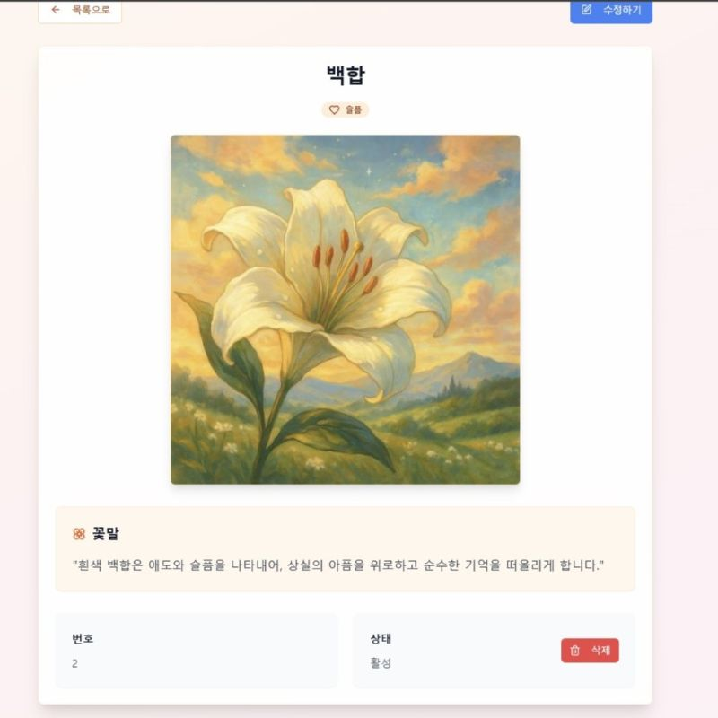

## 프로젝트 소개
이 프로젝트는 꽃의 사진, 꽃말, 꽃 이름 등의 다양한 정보를 프론트엔드에서 조회하고 관리할 수 있습니다.

첨부한 백엔드 레포지토리의 주소로 이동하면 백엔드 관련 내용을 확인할 수 있습니다.

[백엔드 GitHub 주소](https://github.com/ByeongWoo99/Flower_Service)

## 주요 기능 (프론트엔드)
- **꽃 목록 조회**: 전체 꽃 데이터를 카드, 리스트 등 다양한 UI 컴포넌트로 표시
- **꽃 상세 정보 확인**: 사진, 꽃말, 이름 등의 세부 정보를 상세 페이지로 제공
- **꽃 정보 생성**: 폼 입력을 통해 새로운 꽃 정보를 입력하고, 서버로 전송하여 저장
- **꽃 정보 수정**: 기존 꽃 정보를 편집 폼에서 수정하고 변경사항을 반영
- **꽃 정보 삭제**: Soft Delete 방식을 적용하여 UI상에서 삭제 처리


## 프로젝트 요구 사항

- **Node.js**: v16.0.0 이상 (권장 LTS: v18.x)  
- **npm**: v8.0.0 이상  

## 프로젝트 실행법

```sh
# 프로젝트의 Git URL을 사용하여 레포지토리를 클론
git clone <https://github.com/ByeongWoo99/memorial-flower-garden.git>

# 프로젝트 디렉토리로 이동
cd <YOUR_PROJECT_NAME>

# 의존성 설치
npm i

# 서버를 시작
npm run dev
```

## 환경 설정
백엔드 서버의 주소 설정을 백엔드 파일 실행 환경에 맞게 설정해 주세요.

```
// memorial-flower-garden\src\config\api.ts, 현재 설정 값
BASE_URL : 'http://localhost:8080'
```

## API 목록
아래 테이블은 백엔드 API 주소와 연동되는 주소입니다.

| 기능         | HTTP Method | Api Path                         |
| ------------ | ----------- | -------------------------------- |
| 꽃 상세 조회 | GET         | `${API_CONFIG.BASE_URL}/admin/flowers/${seq}?page=${page}`     |
| 꽃 목록 조회 | GET         | `${API_CONFIG.BASE_URL}/flowers?page=${page}&search=${search}`                    |
| 꽃 생성      | POST        | `${API_CONFIG.BASE_URL}/flowers/new`                   |
| 꽃 정보 수정 | PATCH       | `${API_CONFIG.BASE_URL}/flowers/${flower.seq}/edit?page=${page}`                   |
| 꽃 삭제      | DELETE      | `${API_CONFIG.BASE_URL}/admin/flowers/${seq}`        |

**프론트 엔드 URL 설정**
src/App.tsx파일에 설정된 주소 목록입니다.

| 경로                | 컴포넌트             | 설명               |
| ------------------- | -------------------- | ------------------ |
| `/`                 | `Index`              | 메인 페이지         |
| `/flowers`          | `FlowerManagement`   | 꽃 목록 조회        |
| `/flowers/new`      | `FlowerCreate`       | 꽃 생성 페이지      |
| `/flowers/:seq`     | `FlowerDetail`       | 꽃 상세 정보 조회   |
| `/flowers/:seq/edit`| `FlowerEdit`         | 꽃 정보 수정 페이지 |


## 사용된 기술 스택

- Vite
- TypeScript
- React
- shadcn-ui
- Tailwind CSS

## 실행 화면

### 메인 페이지
- 꽃 관리 시스템의 메인 화면입니다.


### 꽃 목록 페이지
- 전체 꽃 데이터를 카드 형태로 조회할 수 있는 화면입니다.


### 꽃 상세 정보
- 꽃 하나의 상세한 정보를 보여주는 페이지입니다.



### 꽃 등록 페이지
- 새로운 꽃 정보를 입력하는 페이지입니다.


### 꽃 수정 페이지
- 등록된 꽃 정보를 수정하는 페이지입니다.

